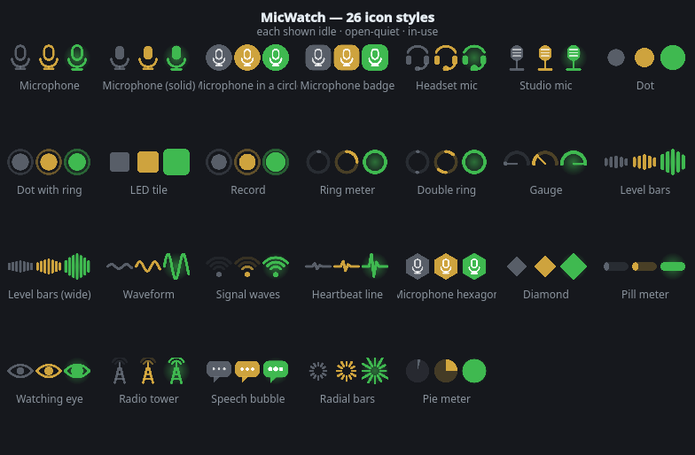

# MicWatch

A microphone in-use tray indicator for PipeWire, built for KDE Plasma.

It does one thing: **light up when the microphone is actually being used** — and it lets
you decide what "being used" means, with a level threshold you set yourself.



## Why not the built-in one

Plasma's microphone indicator lights up the moment any application *opens* the input
device, even when nothing is going through it. MicWatch separates the two:

| State | Meaning | Default colour |
|-------|---------|----------------|
| Idle | nothing is recording | grey `#6e7681` |
| Open, quiet | an app holds the mic, but the signal is below your threshold | amber `#e3b341` |
| In use | signal is above your threshold | green `#3fb950` |

## Features

- **18 icon styles** — microphone (outline/solid/circle/badge), headset mic, studio mic,
  dot, dot with ring, LED tile, record, ring meter, double ring, gauge, level bars,
  wide bars, waveform, signal waves and heartbeat line. Picked from a visual grid.
- **15 animations** — none, pulse, breathe, blink, fast strobe, glow halo, ripple rings,
  bounce, wobble, spin, heartbeat, follow-the-level, glow-with-the-level, rainbow, siren.
- **Full colour control** — one colour per state, hex field, colour picker and 12 presets.
- **User-defined threshold in dBFS** — live meter on a dB scale (−60 … 0 dB), a numeric
  readout, and a *Set just above noise* button that listens for 3 s and parks the
  threshold 7 dB above your room noise.
- **Pick which input to measure** — follow the recording app, or pin one device.
- **Hold time** so the icon does not flicker between words.
- Ignores monitor-of-sink streams; virtual sources (screen share, loopback) are opt-in.
- Ignore list for apps you do not care about (`easyeffects`, `obs`, …).
- Optional: hide the icon completely while nothing is recording.
- Tooltip and menu show **which** applications are recording and from which device.
- Fast attack / adjustable release, so the icon reacts on the first syllable and does not
  strobe between words.

## Requirements

- PipeWire with `pw-cat` and `pactl` (`pipewire-utils`, `pulseaudio-utils`)
- Python 3.11+ and PySide6 (`sudo dnf install python3-pyside6`)

## Install

```sh
./install.sh     # creates ~/.local/bin/micwatch and the .desktop entry
micwatch         # run it
```

### Start with the session

Two equivalent switches, both writing `~/.config/autostart/micwatch.desktop`:

- right-click the tray icon → **Start on login**
- **Settings → Behaviour → Startup → Start MicWatch automatically on login**

The entry points at `~/.local/bin/micwatch` when the launcher is installed, and falls back
to `env PYTHONPATH=<repo> python3 -m micwatch` when running straight from a clone. It also
shows up in **System Settings → Autostart**, and a single-instance lock keeps a second copy
from starting if one is already running.

To avoid two microphone icons, disable Plasma's own:
**System Settings → Quick Settings → System Tray → Entries → Microphone → Disabled**.

## How it works

Levels are RMS per 30 ms block, converted to dBFS. A quiet room measures around −50 dB
and speech lands between −35 and −20 dB, which is why the default threshold is −42 dB.

- `pactl subscribe` + `pactl -f json list source-outputs` tell MicWatch *who* is
  recording and from which source (streams reading a sink monitor are not microphone use).
- Only while some app is recording (and only if the threshold is enabled) does MicWatch
  open its own `pw-cat` capture — named `MicWatch Meter` — to measure the RMS level.
  With the threshold turned off, MicWatch never touches the microphone at all.

Config lives in `~/.config/micwatch/config.json`; every change in the settings window is
applied and saved immediately.

## Layout

```
micwatch/config.py     defaults, load/save
micwatch/audio.py      stream detection (pactl) + level meter (pw-cat)
micwatch/icons.py      every icon painted at runtime with QPainter
micwatch/tray.py       state machine: idle / open-quiet / in-use
micwatch/settings.py   settings window with live meter
```
