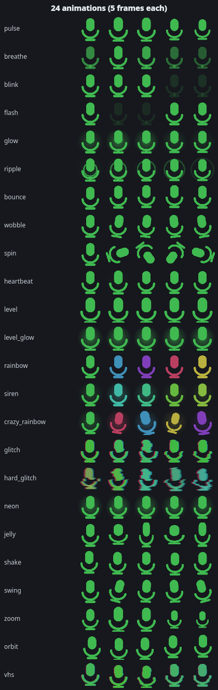
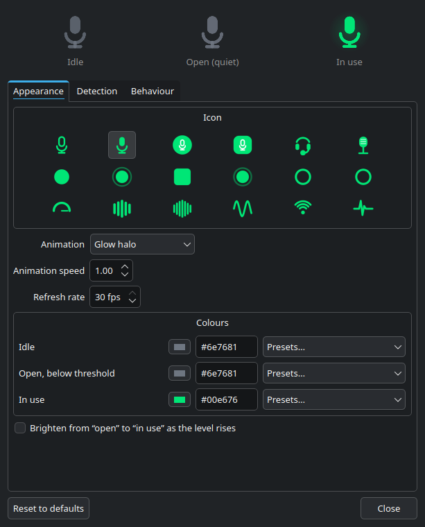
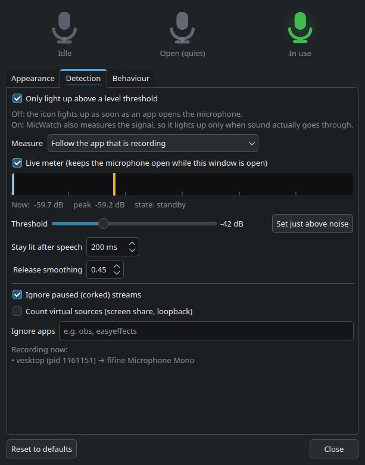
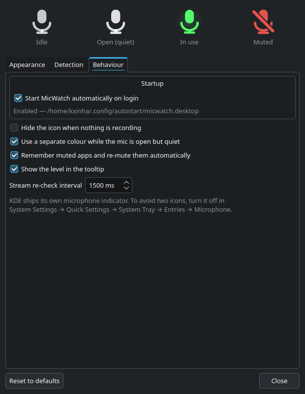
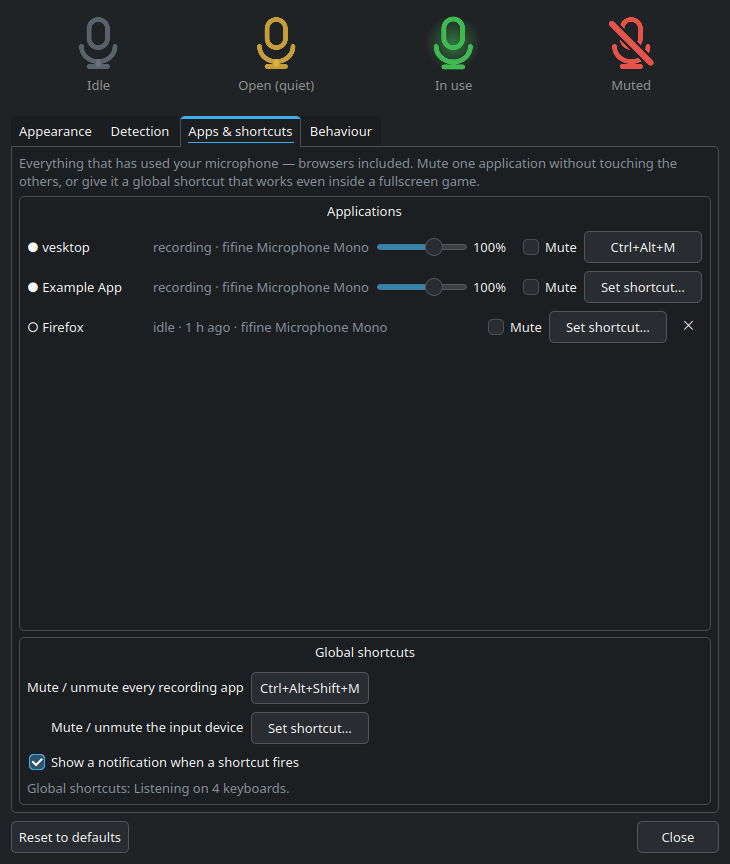

# MicWatch

A microphone in-use tray indicator for PipeWire, built for KDE Plasma.

It lights up when the microphone is **actually being used** — you decide what that means,
with a threshold in dBFS you set yourself — it lets you **mute one application's microphone
without touching the others**, and it can do that from a **global keyboard shortcut** that
works even inside a fullscreen game.




## Why not the built-in one

Plasma's microphone indicator lights up the moment any application *opens* the input
device, even when nothing is going through it. MicWatch separates the two:

| State | Meaning | Default colour |
|-------|---------|----------------|
| Idle | nothing is recording | grey `#6e7681` |
| Open, quiet | an app holds the mic, but the signal is below your threshold | amber `#e3b341` |
| In use | the signal is above your threshold | green `#3fb950` |
| Muted | you muted the app (or the device); the icon gets a slash | red `#e5534b` |

## Install

One command, any of the distros below:

```sh
curl -fsSL https://raw.githubusercontent.com/gabrielmf1998/MicWatch-KDE/main/install-online.sh | sh
```

Or grab a package from the [latest release](https://github.com/gabrielmf1998/MicWatch-KDE/releases/latest):

```sh
sudo dnf install ./micwatch-kde-1.3.0-1.fc46.noarch.rpm       # Fedora
sudo apt install ./micwatch-kde_1.3.0-1_all.deb               # Debian / Ubuntu
sudo pacman -U ./micwatch-kde-1.3.0-1-any.pkg.tar.zst         # Arch
chmod +x MicWatch-KDE-x86_64.AppImage && ./MicWatch-KDE-x86_64.AppImage
```

From a clone, into `~/.local` and without touching the system:

```sh
git clone https://github.com/gabrielmf1998/MicWatch-KDE.git
cd MicWatch-KDE && ./install.sh && micwatch
```

The AppImage is a thin launcher: it carries MicWatch itself and uses the system
`python3` + PySide6, so it stays under a megabyte instead of bundling all of Qt.

### Requirements

- PipeWire with `pw-cat` and `pactl` (`pipewire-utils`, `pulseaudio-utils`)
- Python 3.11+ and PySide6 (`sudo dnf install python3-pyside6`)

The native packages pull these in for you.

## Screenshots

Pick an icon, an animation and a colour per state. The three icons at the top are a live
preview — the "In use" one plays the animation you selected:



Set the threshold against a live dB meter. The amber line is the threshold, the white line
is the peak; *Set just above noise* listens for 3 seconds and parks the threshold 7 dB
above your room noise:



Start with the session, hide the icon while idle, or drop the separate "quiet" colour:



## Per-application mute

Right-click the tray icon and you get one entry per program currently recording:

```
Microphone in use — vesktop  ·  Level: -31 dB
────────────────────────────────────────────
[x] Mute vesktop
[ ] Mute Firefox
    Unmute obs (remembered)
────────────────────────────────────────────
[ ] Mute the microphone device
```

Muting an app mutes **only that application's capture stream** (`source-output`), so a
call keeps working while a game, a browser tab or a recorder hears silence. The device
entry mutes the input for everyone at once, the way a hardware switch would.

Muted apps are remembered by name: when the program opens the microphone again — after a
restart, or in a new call — MicWatch re-mutes it automatically. Turn that off in
**Behaviour → Remember muted apps**.

The Detection tab lists the same applications with a **capture volume slider** (0–150%)
next to each mute box, so you can ride one program's mic gain without touching the device.

While everything recording is muted, the tray icon turns red with a slash and MicWatch
stops metering — it will not open the microphone to measure something that is silent.

## Applications and shortcuts

MicWatch keeps a list of everything that has used your microphone — browsers included —
so you can act on an application even while it is idle:



Each row gives you a **mute** box, the **capture volume** while it is recording, and a
**global shortcut**. Pressing that combination toggles the mute for that one application:
your call keeps working while a game, a recorder or a browser tab hears silence. Muting an
idle app is remembered, so it applies the moment that app opens the microphone again.

Two more shortcuts cover everything at once: *mute every recording app* and *mute the
input device*.

### How the shortcuts work

A Qt shortcut only fires while the window has focus, which is useless mid-call, so
MicWatch reads the keyboards directly from `/dev/input`. The combination then works on
Wayland and X11, in a fullscreen game, whatever has focus. Any combination KDE would
accept works — `Shift+B`, `Ctrl+Alt+M`, `Meta+F9`, `Ctrl+Shift+PgDown` — recorded the same
way KDE records them: click the button and press the keys.

Nothing is grabbed and nothing is logged: the listener only compares each key press
against the combinations you configured, and it does not even start until you set one.

Two requirements, both checked in the UI, which tells you exactly what to do if either is
missing:

- the `python3-evdev` package (a *Recommends* of the native packages, so it usually comes
  along)
- your user in the `input` group — `sudo usermod -aG input $USER`, then log back in

## Features

- **Per-application mute** from the tray menu, remembered across restarts of the app.
- **Global shortcut per application** (`Shift+B`, `Ctrl+Alt+M`, …) that works in fullscreen.
- **List of every app that has used the mic**, browsers included, with mute and shortcut
  for each — even while they are idle.
- **Per-application capture volume** (0–150%) from the Detection tab.
- **Device mute** for every application at once.
- **Icon size slider** — every style fills the tray slot at 100%, dial it down to taste.
- **26 icon styles** — microphone (outline/solid/circle/badge/hexagon), headset mic,
  studio mic, dot, dot with ring, LED tile, diamond, record, ring meter, double ring,
  gauge, pie, pill meter, level bars, wide bars, radial bars, waveform, signal waves,
  heartbeat line, radio tower, speech bubble and a watching eye. Picked from a visual grid.
- **25 animations** — pulse, breathe, blink, fast strobe, glow halo, ripple rings, bounce,
  wobble, spin, heartbeat, follow-the-level, glow-with-the-level, rainbow, siren,
  **crazy rainbow**, **glitch**, **hard glitch**, **neon flicker**, **jelly**, **shake**,
  **swing**, **zoom**, **orbit** and **VHS tracking** — or none at all.
- **Full colour control** — one colour per state (idle, quiet, in use, muted), hex field,
  colour picker and 24 presets.
- **Update check on demand** — one button, one click to upgrade, and nothing runs in the
  background unless you ask.
- **User-defined threshold in dBFS** — live meter on a dB scale (−60 … 0 dB), a numeric
  readout, and a *Set just above noise* button.
- **Pick which input to measure** — follow the recording app, or pin one device.
- Fast attack / adjustable release, so the icon reacts on the first syllable and does not
  strobe between words; plus a hold time after speech stops.
- Ignores monitor-of-sink streams; virtual sources (screen share, loopback) are opt-in.
- Ignore list for apps you do not care about (`easyeffects`, `obs`, …).
- Optional: hide the icon completely while nothing is recording.
- Tooltip and menu show **which** applications are recording and from which device.
- **Start on login** from the tray menu or the Behaviour tab.

## Staying up to date

MicWatch **never phones home on its own** — there is no background check, no timer and no
telemetry. It looks for a new release only when you press the button:

- **Settings → Behaviour → Updates → Check for updates**, or **Check for updates…** in the
  tray menu.
- If something newer exists, you get the release notes and the tray menu keeps an
  **Update to vX.Y.Z…** entry for the rest of the session.
- **Update now** opens a terminal running the installer for your distro, so you can type
  your password and watch it happen. Running from the AppImage, it downloads the new
  AppImage and replaces the one you are running instead.

## Privacy

MicWatch never opens the microphone on its own. The level meter only runs while some other
application is already recording (or while you tick *Live meter* in the settings window to
calibrate). With the threshold turned off it never touches the microphone at all — it just
reads the list of recording streams.

## How it works

- `pactl subscribe` + `pactl -f json list source-outputs` tell MicWatch *who* is recording
  and from which source. Streams reading a sink monitor are loopback, not microphone use.
- While an app records, MicWatch opens its own `pw-cat` capture — it shows up as
  `MicWatch Meter` — and measures RMS per 30 ms block, converted to dBFS.
- Muting uses `pactl set-source-output-mute` on that application's stream, and
  `pactl set-source-mute` for the device; volume uses `set-source-output-volume`.

A quiet room measures around −50 dB and speech lands between −35 and −20 dB, which is why
the default threshold is −42 dB.

Config lives in `~/.config/micwatch/config.json`; every change in the settings window is
applied and saved immediately.

## Start with the session

Two equivalent switches, both writing `~/.config/autostart/micwatch.desktop`:

- right-click the tray icon → **Start on login**
- **Settings → Behaviour → Startup → Start MicWatch automatically on login**

It also shows up in **System Settings → Autostart**, and a single-instance lock keeps a
second copy from starting if one is already running.

To avoid two microphone icons, disable Plasma's own:
**System Settings → Quick Settings → System Tray → Entries → Microphone → Disabled**.

## Layout

```
micwatch/config.py      defaults, load/save
micwatch/audio.py       stream detection, per-app mute/volume (pactl) + meter (pw-cat)
micwatch/icons.py       every icon painted at runtime with QPainter
micwatch/tray.py        state machine: idle / open-quiet / in-use
micwatch/settings.py    settings window with the live dB meter
micwatch/autostart.py   XDG autostart entry
micwatch/hotkeys.py     global shortcuts read from /dev/input
packaging/              rpm spec, deb/arch/AppImage build script
assets/gen_icons.py     regenerates the application icons
```

Build every package into `dist/` with `packaging/build-packages.sh`.

## License

MIT — see [LICENSE](LICENSE).
